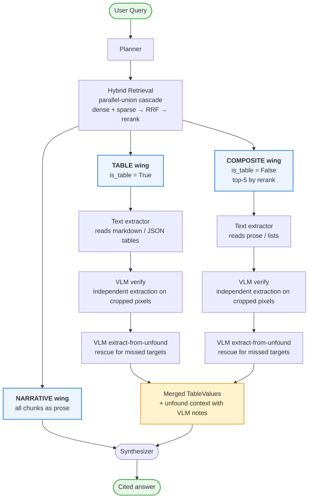

# Agentic RAG for Sustainability Reports

Retrieval-augmented QA over sustainability disclosures — BRSR, GRI, SASB, TCFD, Integrated Reporting, CDP. Upload a PDF, ask questions, get **cited** answers with every number traceable back to the source chunk.

Built to be honest about what a report actually discloses: when a value is split by segment (Male/Female, Regular/Contractor), the answer says so instead of silently fabricating a "combined" total from misidentified cells.

---

## Architecture — three parallel wings



Each extraction wing runs a **text extractor** (over Chandra's OCR output) and an **independent VLM** (over the source PDF's cropped pixels — VLM never sees the text extractor's guess). The two readings are merged symmetrically:

- **values agree + labels agree** → confidence upgraded to `high` (mutual vote)
- **VLM `high` + disagrees** → REPLACE the text extractor's value (shifted-header rescue)
- **VLM medium/low + disagrees** → keep original but downgrade to `low`, both readings preserved in note as `DISPUTED`
- **VLM found=false with a note** → target flows to `unfound_context` for the synthesizer

The synthesizer treats the pipeline's conclusions as **authoritative** — if a target is unfound, it does not re-derive the value from raw chunk markdown. VLM notes become the primary evidence for what the report actually discloses.

---

## Key mechanisms

- **Chandra-OCR-2 on Modal + H100** — per-page fanout at concurrency 96, extracts structured tables (headers + rows) plus prose with bboxes
- **Hybrid retrieval + parallel-union cascade** — Fireworks dense (Qwen3-embedding-8b, 4096-d) + local BM25 sparse, fused via Qdrant RRF; strict-and-relaxed queries run in parallel and union the results, so a fragile `must_phrases` filter can't silently starve retrieval
- **Independent VLM verification** — VLM never sees the text extractor's guess; commits to its own reading of the pixels; merge logic compares symmetrically
- **Segment-vs-combined detection** — when target implies a combined value but only segments are disclosed, the pipeline refuses to fabricate a total. The synthesizer sees the VLM's semantic note ("Male=X, Female=Y, no combined figure") and reports what IS disclosed
- **Content-aware planning** — at ingestion, per-report metadata (chunk distribution by type, dominant style) is written to `data/reports/*.metadata.json`; the planner reads it and adapts decomposition strategy to the report shape
- **Full audit trail** — every VLM response (with reasoning notes), every merge decision, every planner subquery, every sanitizer drop is logged. `data/query_logs/*.txt` is grep-able

---

## Stack

| Layer | Choice |
|---|---|
| OCR | Chandra-OCR-2 (vLLM on Modal H100) |
| Text LLM | Fireworks Qwen3.7-Plus (planner, critic, synthesizer, extractors) |
| Vision LLM | Groq Llama-4 Scout (query-time + ingest-time VLM) |
| Dense embeddings | Fireworks Qwen3-Embedding-8B (4096-d) |
| Sparse | Local BM25 tokenizer → Qdrant sparse with IDF modifier |
| Reranker | Fireworks Qwen3-Reranker-8B |
| Vector store | Qdrant (local file mode, no Docker required) |
| UI | Streamlit |

---

## Setup

```bash
# 1. Install dependencies (uv)
uv sync

# 2. Configure — copy the template, fill in real keys
cp .env.example .env
# edit .env with FIREWORKS_API_KEY, GROQ_API_KEY, and the CHANDRA_OCR_URL from your Modal deploy

# 3. Deploy Chandra OCR to Modal (one time)
modal deploy deploy/modal_chandra.py

# 4. Run the app
uv run streamlit run app.py
```

Upload a PDF via the UI to ingest. Once ingestion completes (chunks + per-report metadata written), ask any question.

---

## Diagnostic scripts

Two probe scripts for when something looks wrong:

- **`scripts/probe_chandra.py`** — send specific pages to Chandra, inspect the raw block labels and bboxes it emits. Use when ingestion output looks miscategorized.

  ```bash
  uv run python scripts/probe_chandra.py --pdf data/reports/x.pdf --pages 21,22,23 --out data/probe/xyz --vlm
  ```

- **`scripts/probe_retrieval.py`** — trace a query through every retrieval stage (planner → dense → sparse → post-filter → rerank) and pinpoint exactly where the answer chunk drops out.

  ```bash
  uv run python scripts/probe_retrieval.py --query "..." --report-id X --target-substring "D. Sundaram"
  ```

---

## Project layout

```
src/agentic_rag/
├── agents/           # planner, critic, synthesizer + table/composite extractors + VLM verifiers
├── ingestion/        # Chandra client, VLM description, chunk metadata
├── retrieval/        # hybrid parallel-union cascade, reranker, BM25
├── vectordb/         # Qdrant wrapper
├── orchestrator.py   # answer_query loop; wires everything
├── query_log.py      # per-query audit log formatter
└── schemas.py        # Pydantic contracts between pipeline stages
config/settings.py    # env-backed settings
deploy/modal_chandra.py  # Modal deployment for Chandra OCR
scripts/              # diagnostic probes
app.py                # Streamlit UI
```

---

## License

MIT
